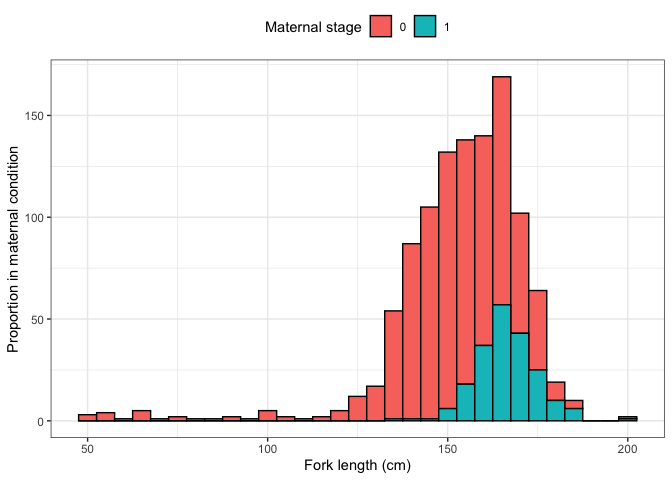
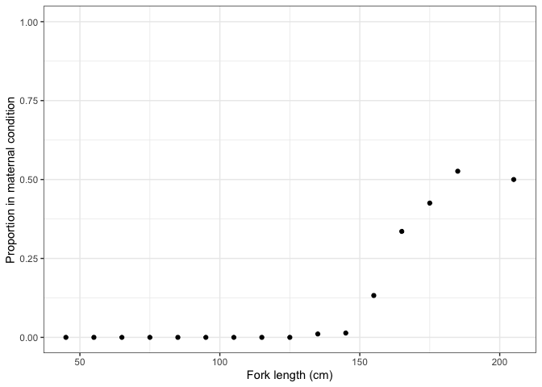

# Quantifying maternal reproductive output of chondrichthyan fishes


## Example

Load data for sandbar shark maternity data set. Rows are data from
individuals sharks x is fork length (cm) and z is maternal status (0 =
non maternal, 1 = maternal).

``` r
library(tidyverse)

theme_set(theme_bw())

data <- read_rds(here::here("data", "empirical-plumbeus.Rds"))

data %>% 
  ggplot() + 
  geom_histogram(aes(x = x, fill = as.factor(z)), binwidth = 5, col = "black") +
  labs(x = "Fork length (cm)", y = "Proportion in maternal condition") + 
  guides(fill = guide_legend(title = "Maternal stage")) + 
  theme(legend.position = "top")
```



## Bin data into suitable length categories for plotting

``` r
brks = seq(40, 220, 10)
data_binned <- data %>%
  mutate(x_bin = findInterval(x, brks)) %>% 
  mutate(x_bin = (brks[x_bin] + brks[x_bin + 1]) / 2) %>% 
  group_by(x_bin) %>%
  summarise(p = sum(z)/ n())


(p <- ggplot()  + 
  geom_point(data = data_binned, aes(x = x_bin, y = p), col = "black") + 
  ylim(0, 1) +
  labs(x = "Fork length (cm)", y = "Proportion in maternal condition"))
```



Compile 3 parameter logistic model

``` r
library(TMB)
compile("code/logistic3.cpp")
```

    [1] 0

``` r
dyn.load(dynlib("code/logistic3"))
```
