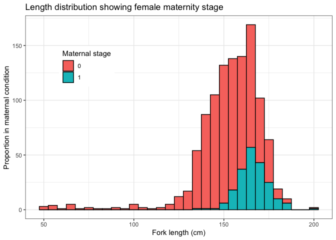
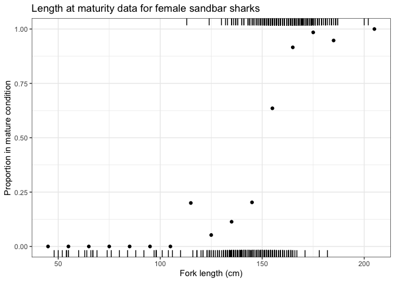
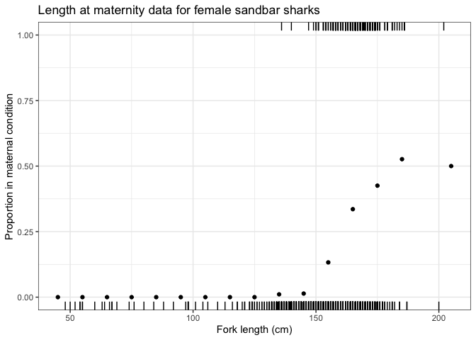
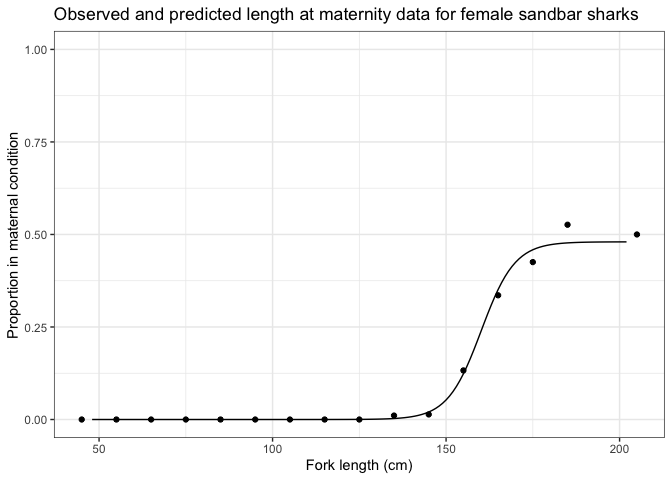

# Quantifying maternal reproductive output of chondrichthyan fishes


## Alastair Harry, Ivy Baremore, Andrew Piercy

Published scientific manuscript:

Harry AV, Baremore IE & Piercy AN (2024) Quantifying maternal
reproductive output of chondrichthyan fishes. *Canadian Journal of
Fisheries and Aquatic Sciences.*
<https://doi.org/10.1139/cjfas-2024-0031>


Repository structure:

    .
    ├── README.md
    ├── README.qmd
    ├── README.rmarkdown
    ├── README_files
    │   └── figure-commonmark
    │       ├── unnamed-chunk-1-1.png
    │       ├── unnamed-chunk-2-1.png
    │       ├── unnamed-chunk-3-1.png
    │       ├── unnamed-chunk-4-1.png
    │       ├── unnamed-chunk-5-1.png
    │       ├── unnamed-chunk-6-1.png
    │       └── unnamed-chunk-7-1.png
    ├── code
    │   ├── empirical.R
    │   ├── functions.R
    │   ├── logistic2.cpp
    │   ├── logistic2.o
    │   ├── logistic2.so
    │   ├── logistic2maternal.cpp
    │   ├── logistic2maternal.o
    │   ├── logistic2maternal.so
    │   ├── logistic3.cpp
    │   ├── logistic3.o
    │   ├── logistic3.so
    │   ├── setup.R
    │   ├── simulation.R
    │   └── summarise_results.R
    ├── data
    │   ├── empirical-plumbeus.csv
    │   ├── empirical-predictions.Rds
    │   ├── empirical-summary.Rds
    │   ├── simulations-pivot.Rds
    │   ├── simulations-summarised.Rds
    │   ├── simulations.Rds
    │   └── table-1.xlsx
    ├── img
    │   └── figure1.png
    ├── maternity-function.Rproj
    ├── reports
    │   ├── fig-supp.pdf
    │   ├── figs.pdf
    │   ├── figs.tex
    │   ├── figs_files
    │   │   └── figure-latex
    │   │       ├── cjfas-2024-0031_02.pdf
    │   │       ├── unnamed-chunk-3-1.pdf
    │   │       ├── unnamed-chunk-4-1.pdf
    │   │       ├── unnamed-chunk-5-1.pdf
    │   │       ├── unnamed-chunk-6-1.pdf
    │   │       └── unnamed-chunk-7-1.pdf
    │   ├── main-text.pdf
    │   ├── main-text.tex
    │   ├── tabs.pdf
    │   └── tabs.tex
    ├── rmds
    │   ├── extras
    │   │   ├── Reference_Document.docx
    │   │   ├── abbreviations.json
    │   │   ├── author-info-blocks.lua
    │   │   ├── cjfas.csl
    │   │   ├── maternal-output.bib
    │   │   ├── mytemplate.tex
    │   │   └── scholarly-metadata.lua
    │   ├── figures-supp.Rmd
    │   ├── figures-supp_files
    │   │   └── figure-latex
    │   │       ├── unnamed-chunk-1-1.pdf
    │   │       ├── unnamed-chunk-10-1.pdf
    │   │       ├── unnamed-chunk-11-1.pdf
    │   │       ├── unnamed-chunk-2-1.pdf
    │   │       ├── unnamed-chunk-3-1.pdf
    │   │       ├── unnamed-chunk-4-1.pdf
    │   │       ├── unnamed-chunk-5-1.pdf
    │   │       ├── unnamed-chunk-6-1.pdf
    │   │       ├── unnamed-chunk-7-1.pdf
    │   │       ├── unnamed-chunk-8-1.pdf
    │   │       └── unnamed-chunk-9-1.pdf
    │   ├── figures.Rmd
    │   ├── figures_files
    │   │   └── figure-latex
    │   │       ├── cjfas-2024-0031_02.pdf
    │   │       ├── unnamed-chunk-3-1.pdf
    │   │       ├── unnamed-chunk-4-1.pdf
    │   │       ├── unnamed-chunk-5-1.pdf
    │   │       └── unnamed-chunk-6-1.pdf
    │   ├── manuscript.Rmd
    │   ├── manuscript.pdf
    │   ├── manuscript.synctex.gz
    │   ├── manuscript.tex
    │   ├── tables-supp.Rmd
    │   └── tables.Rmd
    ├── run_all.R
    └── tables
        ├── table-s1.csv
        └── table-s1.xlsx

# Empirical example

## Load data

Start by loading the example data. The dataset is an amalgamation of
data from two studies on the reproductive biology of sandbar sharks by
[Baremore and Hale (2012)](https://doi.org/10.1080/19425120.2012.700904)
and [Piercy et al. (2016)](https://doi.org/10.1111/jfb.12945).

``` r
library(tidyverse)

theme_set(theme_bw())

data <- read_csv(here::here("data", "empirical-plumbeus.csv")) %>% 
  select(-source)
```

In this analysis, the fork length (FL) of the shark is the independent
variable, and is continuous number ranging from 48cm to 202cm. Maturity
stage and maternity stage are the dependent variables and are binary
(either 0 for non mature / non maternal or 1 for mature / maternal).
Rows in the data are data from individuals sharks. x is FL, y is
maturity stage, and z is maternity stage.

``` r
head(data)
```

    # A tibble: 6 × 3
          x     y     z
      <dbl> <dbl> <dbl>
    1   145     1     0
    2   146     0     0
    3   149     0     0
    4   182     0     0
    5   148     1     0
    6   151     1     1

The data consist of maturity and maternity at length data for 1087
female sandbar sharks, 640 of which are mature, and 206 of which were in
maternal condition.




To visualize the binary response variable, it can be helpful to divide
the explanatory variable (FL) into discrete length intervals. In this
case 10cm length bins work well. Marginal rug plots are also helpful for
displaying the distribution of individual data points.

``` r
brks = seq(40, 220, 10)
data_binned <- data %>%
  filter(!is.na(y)) %>% 
  mutate(x_bin = findInterval(x, brks)) %>% 
  mutate(x_bin = (brks[x_bin] + brks[x_bin + 1]) / 2) %>% 
  group_by(x_bin) %>%
  summarise(p = sum(y)/ n())

ggplot()  + 
  geom_rug(data = filter(data, y == 1), aes(x = x), sides = "t") +
  geom_rug(data = filter(data, y == 0), aes(x = x), sides = "b") +
  geom_point(data = data_binned, aes(x = x_bin, y = p), col = "black") + 
  ylim(0, 1) +
  labs(x = "Fork length (cm)", y = "Proportion in mature condition", title = "Length at maturity data for female sandbar sharks") 
```



``` r
brks = seq(40, 220, 10)
data_binned <- data %>%
  mutate(x_bin = findInterval(x, brks)) %>% 
  mutate(x_bin = (brks[x_bin] + brks[x_bin + 1]) / 2) %>% 
  group_by(x_bin) %>%
  summarise(p = sum(z)/ n())

ggplot()  + 
  geom_rug(data = filter(data, z == 1), aes(x = x), sides = "t") +
  geom_rug(data = filter(data, z == 0), aes(x = x), sides = "b") +
  geom_point(data = data_binned, aes(x = x_bin, y = p), col = "black") + 
  ylim(0, 1) +
  labs(x = "Fork length (cm)", y = "Proportion in maternal condition", title = "Length at maternity data for female sandbar sharks") 
```



## 3 parameter logistic maternity function (3PLF)

To run the 3PLF model, begin by loading the `TMB` library, compile the
`C++` file and load the compiled file.

``` r
library(TMB)
compile("code/logistic3.cpp")
dyn.load(dynlib("code/logistic3"))
```

Initialize a list of parameters for the model with their starting
values, then construct the objective function to be minimised using R.
Next use `nlminb` to optimize the model. `nlminb` takes as its arguments
a vector of the parameters to be estimated, the function to be
optimized, an analytical gradient vector that aids with optimization,
and vectors of maximum and minimum allowable values for the model
parameters.

``` r
# Parameter list
pars <- list(m50 = 160, m95 = 170, c = 0.5)

# Create objective function
obj <- MakeADFun(
  data = data,
  parameters = pars,
  DLL = "logistic3"
)

# Optimize
opt <- nlminb(obj$par, obj$fn, obj$gr, lower = c(0, 0, 0), upper = c(Inf, Inf, 1))
```

To check whether the model has successfully converged, run the
following:

``` r
opt$convergence
```

    [1] 0

The maximum likelihood values of parameters estimated by `TMB` can be
obtained as follows:

``` r
opt$par
```

            m50         m95           c 
    160.1332951 174.4099303   0.4800554 

The estimated length at 50% maternity ($L_{50}$) and length at 95%
maternity ($L_{95}$) are 160 and 174cm, respectively. $L_{50}$ is
estimated length at which half of the females in the population were in
maternal condition, meaning they would have given birth and contributed
to recruitment within that year. The final parameter is the asymptote of
the logistic function, $P_{Max}$, which is the maximum proportion of
females in a given year in maternal condition, in this case 0.48 (or 48%
of the population).

The estimated proportion of females in maternal condition at a given
length can then be calculated using the maximum likelihood values of the
parameters from the fitted model.

``` r
# Length at 50% maternity
m50 <- opt$par[[1]]

# Length at 95% maternity
m95 <- opt$par[[2]]

# PMAX
pmax <- opt$par[[3]]

# 
newdata <- tibble(len = min(data$x):max(data$x)) %>% 
    mutate(matern = (pmax / (1 + exp(-log(19) * ((len - m50) / (m95 - m50))))))

ggplot()  + 
  geom_point(data = data_binned, aes(x = x_bin, y = p), col = "black") + 
  geom_line(data = newdata, aes(x= len, y = matern)) + 
  ylim(0, 1) +
  labs(x = "Fork length (cm)", y = "Proportion in maternal condition", title = "Length at maternity data for female sandbar sharks") 
```


