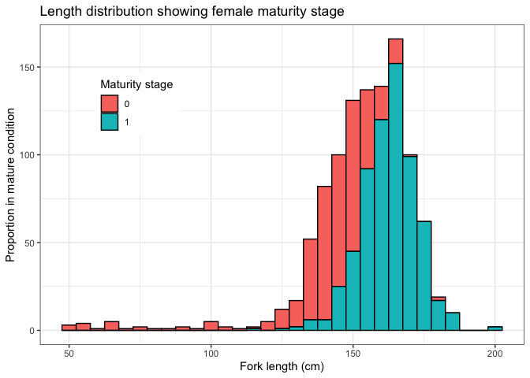

# Quantifying maternal reproductive output of chondrichthyan fishes


## Alastair Harry, Ivy Baremore, Andrew Piercy

Published scientific manuscript:

Harry AV, Baremore IE & Piercy AN (2024) Quantifying maternal
reproductive output of chondrichthyan fishes. *Canadian Journal of
Fisheries and Aquatic Sciences*


Repository structure

fs::dir_tree()

# Empirical example

## Load data

Load sandbar shark maternity data set.

``` r
library(tidyverse)

theme_set(theme_bw())

data <- read_csv(here::here("data", "empirical-plumbeus.csv")) %>% 
  select(-source)
```

Rows are data from individuals sharks. *x* is fork length (cm) and *z*
is maternal status (0 = non maternal, 1 = maternal).

``` r
head(data)
```

    # A tibble: 6 × 3
          x     y     z
      <dbl> <dbl> <dbl>
    1   145     1     0
    2   146     0     0
    3   149     0     0
    4   182     0     0
    5   148     1     0
    6   151     1     1

The dataset consists of maturity and maternity at length data for 1087
female sandbar sharks, 640 of which are mature, and 206 of which were in
maternal condition.

``` r
data %>% 
  ggplot() + 
  geom_histogram(aes(x = x, fill = as.factor(z)), binwidth = 5, col = "black") +
  labs(x = "Fork length (cm)", y = "Proportion in maternal condition") + 
  guides(fill = guide_legend(title = "Maternal stage")) + 
  theme(legend.position = "top")
```



Bin data into suitable length categories for plotting, in this case 10cm
length bins work well. Marginal rug plots are also helpful for
displaying the distribution of individual data points.

``` r
brks = seq(40, 220, 10)
data_binned <- data %>%
  mutate(x_bin = findInterval(x, brks)) %>% 
  mutate(x_bin = (brks[x_bin] + brks[x_bin + 1]) / 2) %>% 
  group_by(x_bin) %>%
  summarise(p = sum(z)/ n())

ggplot()  + 
  geom_rug(data = filter(data, z == 1), aes(x = x), sides = "t") +
  geom_rug(data = filter(data, z == 0), aes(x = x), sides = "b") +
  geom_point(data = data_binned, aes(x = x_bin, y = p), col = "black") + 
  ylim(0, 1) +
  labs(x = "Fork length (cm)", y = "Proportion in maternal condition")
```


## 3 parameter logistic maternity function (3PLF)

To run the 3PLF model, first compile the `TMB`

``` r
library(TMB)
compile("code/logistic3.cpp")
```

    [1] 0

``` r
dyn.load(dynlib("code/logistic3"))
```

``` r
# Parameter list
pars <- list(m50 = 160, m95 = 170, c = 0.5)

# Create objective function
obj <- MakeADFun(
  data = data,
  parameters = pars,
  DLL = "logistic3"
)
```

    Constructing atomic D_lgamma

``` r
# Optimize
opt <- nlminb(obj$par, obj$fn, obj$gr, lower = c(0, 0, 0), upper = c(Inf, Inf, 1))
```

    outer mgc:  46.23431 
    outer mgc:  5.769743 
    outer mgc:  32.6263 
    outer mgc:  51.82513 
    outer mgc:  0.6722857 
    outer mgc:  2.712151 
    outer mgc:  5.241134 
    outer mgc:  3.271799 
    outer mgc:  0.8418487 
    outer mgc:  0.03648506 
    outer mgc:  0.04359347 
    outer mgc:  0.003077501 
    outer mgc:  0.00157544 
    outer mgc:  0.0005905671 
